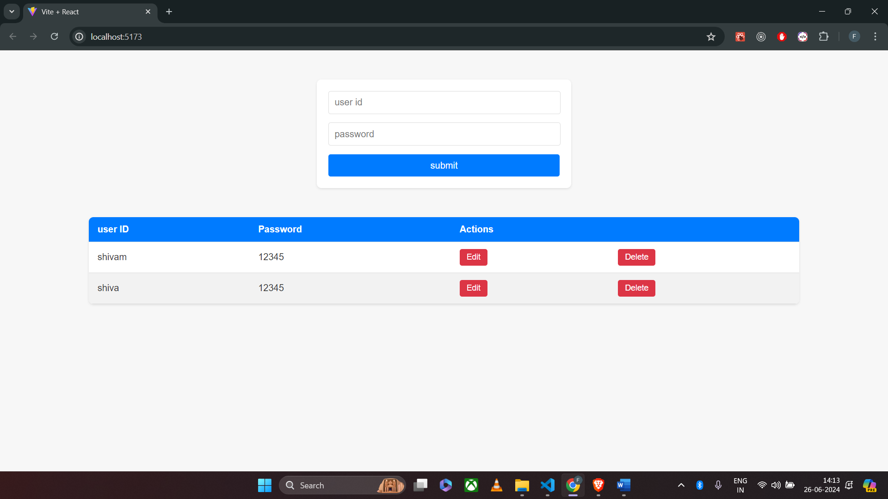

<!-- note -->

i don't have that much idea regarding create backend API i am learning now days that i know basic stuff
related to backend and i would like to know more in future to become fully mernstack developer

i tried tto complete task

for react knowledge i have create one todo repo in react i know mostly about react

like api integration ,react-redux,context-api,hooks,router and all.. and in future i would like to know more

here in react i created a todo type user registration user id and password

which user can create update and delete in that

here is the demo screenshot regarding that

# MERN Registration API

## Installation

### Backend

1. Navigate to the root directory.
2. Run `npm install` to install the dependencies.
3. Run `node server.js` to start the backend server.

### Frontend

1. Navigate to the `client` directory.
2. Run `npm install` to install the dependencies.
3. Run `npm start` to start the React application.

## Usage

- Use the registration form to register a new user.
- View the list of registered users.
- Update user data.
- Delete a user.
